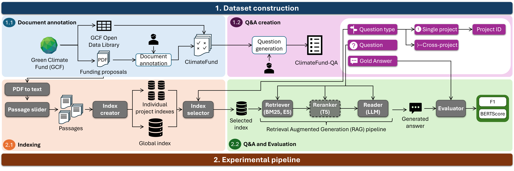

[](https://www.mozilla.org/en-US/MPL/)


# ClimateFund: An Annotated Dataset of Climate Mitigation Projects for Supporting Question Answering <a name="description"></a>
This repository contains a dataset based on funding proposals of 21 climate mitigation projects, submitted to the [Green Climate Fund (GCF)](https://www.greenclimate.fund/).
Climate mitigation documentation is challenging to parse and understand, due to the length of this documents, their multi-modality (commonly comprising tables, figures and
free text), and their highly technical and domain-specific content. Therefore, we provide a dataset with two objectives:

1. Provide structured (partial) annotations of the information contained in these documents, which can be used to train and evaluate models on tasks like information
   extraction and summarization. We name this dataset **ClimateFund**.
2. Based on the structured representations of documents, we generate 500 challenging question-answer pairs to answer from climate mitigation documents. We call this part
   of the dataset **ClimateFund-QA**.

Along with the data, we also provide code for running question-answering experiments. We provide below a figure detailing the methodology we followed for building the datasets, along with the experimental methodology we devise for QA.



## Authors
- Javier Sanz-Cruzado Puig, University of Glasgow (javier.sanz-cruzadopuig@glasgow.ac.uk)
- Miruna Clinciu, University of Glasgow (miruna-adriana.clinciu@glasgow.ac.uk)
- Richard McCreadie, University of Glasgow (richard.mccreadie@glasgow.ac.uk)
- Craig Macdonald, University of Glasgow (craig.macdonald@glasgow.ac.uk)
- Iadh Ounis, University of Glasgow (iadh.ounis@glasgow.ac.uk)


## Dataset documentation

For more information on the dataset and structure, we provide two options:

1. Look at the corresponding dataset README file <a src="dataset/README.md">here</a>
2. Look at the Huggingface data repository:
[](https://huggingface.co/datasets/JavierSanzCruza/ClimateFund)

## Code documentation

Code documentation for running experiments can be found <a src="code/README.md">here</a> 

## Citation

If you use this dataset, please cite the following paper:

```
TBD
```