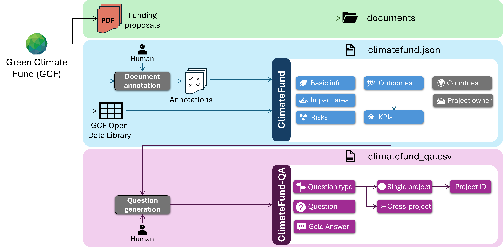

# ClimateFund: An Annotated Dataset of Climate Mitigation Projects for Supporting Question Answering <a name="description"></a>

This repository contains a dataset based on funding proposals of 21 climate mitigation projects, submitted to the [Green Climate Fund (GCF)](https://www.greenclimate.fund/).
Climate mitigation documentation is challenging to parse and understand, due to the length of this documents, their multi-modality (commonly comprising tables, figures and
free text), and their highly technical and domain-specific content. Therefore, we provide a dataset with two objectives:

1. Provide structured (partial) annotations of the information contained in these documents, which can be used to train and evaluate models on tasks like information
   extraction and summarization. We name this dataset **ClimateFund**.
2. Based on the structured representations of documents, we generate 500 challenging question-answer pairs to answer from climate mitigation documents. We call this part
   of the dataset **ClimateFund-QA**.

The following figure shows the construction process for the dataset, and the structure of the repository.



## Table of contents

1. [Dataset description](#description)
2. [Authors](#authors)
3. [Repository contents](#file-structure)
4. [ClimateFund annotations](#annotations)
    1. [General schema](#schema-general)
    2. [Country](#schema-country)
    3. [Project owner / entity](#schema-entity)
    4. [Basic information](#schema-basic)
    5. [Impact area](#schema-impact)
    6. [Risk](#schema-risk)
    7. [Outcomes & co-benefits](#schema-outcome)
    8. [Key performance indicator](#schema-kpi)
5. [ClimateFund-QA](#questions)
6. [Citation](#citations)

## Authors <a name="authors"></a>
- Javier Sanz-Cruzado Puig, University of Glasgow (javier.sanz-cruzadopuig@glasgow.ac.uk)
- Miruna Clinciu, University of Glasgow (miruna-adriana.clinciu@glasgow.ac.uk)
- Richard McCreadie, University of Glasgow (richard.mccreadie@glasgow.ac.uk)
- Craig Macdonald, University of Glasgow (craig.macdonald@glasgow.ac.uk)
- Iadh Ounis, University of Glasgow (iadh.ounis@glasgow.ac.uk)

## Repository contents <a name="file-structure"></a>
This data repository is organized as follows:

- **documents/:** Collection of the Green Climate Fund (GCF) funding proposals annotated in the dataset.
  - **documents/FPXXX.pdf:** Each of the documents, defined by its GCF project identifier (FP+Number).
- **climatefund.json:** JSON file containing the annotations of projects. Format is described below in ...
- **climatefund_qa.csv:** CSV file containing 500 question-answer pairs (ClimateFund-QA). Format is described below in ...
- **LICENSE:** A copy of the MPL-2.0 License.

## ClimateFund annotations <a name="annotations"></a>

The first part of the dataset, **ClimateFund**, contains structured representations of the different climate projects. The information in these representations has
been manually annotated by humans through the [ClimInvest Project Annotation Tool](https://github.com/JavierSanzCruza/climinvest_project_annotation_tool), combined
with the data available at the [Green Climate Fund Open Data Library](https://data.greenclimate.fund/public) and compiled into a JSON file (`climatefund.json').

We describe below the structure of the JSON file containing all the information:

### General schema <a name="schema-general"></a>
This is the general schema for an project/programme. A complete list of 21 projects is provided in the JSON file.
```json
{
  "code": Unique project code (format, FPXXX, where XXX is the project number),
  "url": Official URL containing information and documentation about the project,
  "proposal": URL of the project funding proposal (main document from which information is extracted),
  "countries": A list of countries where the project is developed,
  "entity": Information about the organization that acts as the Project Owner,
  "basic_info": Basic information about the project (title, description, cost...),
  "impact_area": Categorization of the project according to what climate areas is targeting, along with targets.
  "risk": A list of the risks of the climate project.
  "outcomes": A list of the potential benefits and co-benefits of the project, along with specific key performance indicators.
}
```


### Country <a name="schema-country"></a>
Under GCF, a unique project / programme can be developed in one or multiple countries. We collect from the GCF Open Data Library the countries on which the different projects are developed.
From this list of countries, we complete information from the ISO 3166-1 to obtain project codes, and the United Nations geo-scheme to specify the region of the world where each country is located.
We define the information about each country in the schema below:

```json
{
  "code": ISO 3166-1 alpha 3 code of the country,
  "name": Official name of the country,
  "region": Detailed location of the country, following the United Nations geo-scheme. Options:
    - "Africa"
    - "Americas"
    - "Antarctica"
    - "Asia"
    - "Europe"
    - "Oceania",
  "subregion": Finer-grained location of the country (located within the region). Options (if a region does not appear, there is not a further subdivision, and the region name is used):
    - In Africa:
      - "Northern Africa"
      - "Sub-Saharan Africa"
    - In America:
      - "Latin America and the Caribbean"
      - "Northern America"
    - In Anctartica:
        - "Anctartica"
    - In Asia:
        - "Central Asia"
        - "Eastern Asia"
        - "South-Eastern Asia"
        - "Southern Asia"
        - "Western Asia"
    - In Europe:
        - "Eastern Europe"
        - "Northern Europe"
        - "Southern Europe"
        - "Western Europe"
    - In Oceania:
        - "Australia and New Zealand"
        - "Melanesia"
        - "Micronesia"
        - "Polynesia"
  "intermediate_region": An even-finer grained location of the country (within the sub-region). Options below (if a subregion does not appear, there is not a further subdivision, and the subregion name is used):
    - In Africa
      - In Sub-Saharan Africa:
        - "Eastern Africa"
        - "Middle Africa"
        - "Southern Africa"
        - "Western Africa"
    - In America:
      - In Latin America and the Caribbean:
        - "Caribbean"
        - "Central America"
        - "South America"
}
```

### Project owner / entity <a name="schema-entity"></a>
For each project, we collect information about the project owner, i.e. the organization who submitted the funding proposal to the Green Climate Fund and acts as the main contact with the Fund during the development of the project.
In GCF, this organization is known as an *accredited entity*.

```json
{
  "code": A code (generated by GCF) representing an acronym / short code for the organization,
  "name": The name of the organization,
  "type": Type of organization, according to reach. Options:
    - "International"
    - "National"
    - "Regional",
  "size": The size of the organization. Options:
    - "Small"
    - "Medium"
    - "Large"
  "sector": The type of ownership of the organization. Options:
    - "Public"
    - "Private"
  "country": Country where the organization headquarters are (see the Country information above for structure).
}
```

### Basic information <a name="schema-basic"></a>
This section contains basic information about a project, including title, description, cost, etc.

```json
{
  "title": The title of the project,
  "description": An executive summary of the project, as provided in the funding proposal,
  "type": The type of the project. There are two options:
    - "project"
    - "programme"
  Programmes are normally bigger than projects, commonly either privately-funded or spanning multiple countries.
  "sector": Categorization of the project according to the type of funding to receive. Two options:
    - "private", if funded by private organizations, or a blend of public and private funding.
    - "public", if funded only by public bodies,
  "size": Categorization of the project according to its cost.
    - "micro", if costs up to 10 million USD.
    - "small", if costs more than 10 million USD and up to 50 million USD.
    - "medium", if it costs more than 50 million USD and up to 250 million USD.
    - "large", if it costs more than 250 million USD.,
  "cost": The cost of the project. This field only includes the amount.
  "cost_unit": The currency on which the cost is measured. There are four options:
    - "USD", in the case of US dollars
    - "EUR", in the case of Euros
    - "GBP", in the case of British pounds,
    - "JPY", in the case of Japanese yen,
  "expected_implementation_period": The expected number of years needed to implement the project,
  "expected_lifespan": The number of years during which the project is expected to have an impact on climate change.
}
```

### Impact area <a name="schema-impact"></a>
Each project can be categorized according to the areas in which the development is going to act. In this dataset, we
consider only climate mitigation projects, oriented to reduce greenhouse gas emissions. However, there are multiple ways
to reduce those emissions: either by using clean, renewable energies like solar or wind energy instead of fossil fuels, 
developing clean transport or transport networks, and so on. In this section of the project JSON, we provide a categorization of the impact
areas on which the project or programme is intended to act, along with the target mitigation:


```json
{
  "mitigation":
  {
    "areas": A dictionary describing the mitigation areas on which the project aims to cause an impact. For each area, if the project covers them,
             they will appear as '"Area": true'. If not, they will be omitted from the dictionary. One or more areas can be selected.
             There are four possible impact areas:
      - "Energy, mitigation and access" if the project goals are targeting energy consumption and generation.
      - "Low emission transport" if the project goals aim to produce cleaner transport, or facilitate its use.
      - "Buildings, cities, industries and appliances" if the project aims to modify buildings or industries for mitigation.
      - "Forestry and land use" if the project targets the ecosystem,
    "ghg_reduction": Target reduction of greenhouse gas emissions, measured in tons of CO2 equivalent (tCO2eq).
    "energy": if "Energy, mitigation and access" is selected in "areas", this field contains a finer categorization of the project according to which
              types of energy it is supposed to use. If "Energy, mitigation and access" is not selected, or none of the options are selected, this field
              shall not appear. One or more areas can be selected. Format is the same as "areas", with the following options:
      - "Biogas/Biomethane/Biomass",
      - "Geothermal energy",
      - "Hydropower energy",
      - "Off-shore wind energy",
      - "On-shore wind energy",
      - "Solar energy",
    "transport": if "Low emission transport" is selected in "areas", this field contains a finer categorization of the project according to which
              types of low emission transports it is promoting. If "Low emission transport" is not selected, or none of the options are selected, this field
              shall not appear. One or more areas can be selected. Format is the same as "areas", with the following options:
      - "Low/Zero emission road transport",
      - "Operation and infrastructure on railways enabling low-emission transport"
      - "Construction or operation of low/zero emission waterborne vessels",
    "buildings": if "Buildings, cities, industries and appliances" is selected in "areas", this field contains a finer categorization of the project according to which
              types of buildings are targeted. If "Buildings, cities, industries and appliances" is not selected, or none of the options are selected, this field
              shall not appear. One or more areas can be selected. Format is the same as "areas", with the following options:
      - "Construction of new buildings",
      - "Renovation of old buildings"
  },
  "adaptation": false (no adaptation projects are considered in this dataset)
}
```

### Risk <a name="schema-risk"></a>
The project description commonly contains a list of risks for the project. This information is usually structured into the fields detailed in the schema below 

```json
{
  "count": The risk number (starting at 0),
  "type": A categorization of the risk, according to its context. Options:
    - "Technical and operational"
    - "Credit"
    - "Forex"
    - "Governance"
    - "Legal"
    - "Reputational"
    - "Money laundering / Financing terrorism (ML/FT)"
    - "Sanctions"
    - "Prohibited practices"
    - "Social and environmental"
    - "Other (financial)"
    - "Other",
  "probability": Probability that the risk occurs throughout the project. Options:
    - "High"
    - "Medium"
    - "Low",
  "impact": It indicates how severe a risk is for the project if it occurs. Options:
    - "High"
    - "Medium"
    - "Low"
  "description": A description of the risk.
  "mitigation": Mitigation and prevention actions for the risk.
}
```

### Outcomes & co-benefits <a name="schema-outcome"></a>
We collect the potential outcomes, benefits and co-benefits of green projects in a structured manner. This information is provided in a list, as a project might contain
one or more outcomes. We define the following schema:

```json
{
  "count": The outcome number (starting at 0),
  "type": Describes the type of outcome. There are multiple options:
    - "Impact Area" if the benefit is directly connected to the impact areas of the project.
    - "Outcome" if it describes a direct benefit of the project (not directly connected to the impact areas)
    - "Cobenefit" if it describes an indirect or secondary benefit of the project.
    - "Output" if it describes intermediary objectives that build towards the benefits of the project.
  "code": A unique code for the outcome. This may be defined by the GCF document, or be defined by the annotators if it didn't exist,
  "name": The name of the outcome,
  "description": A brief description of the outcome,
  "target_areas": Dictionary selecting the target areas of the outcome. For each targeted area, the JSON shows it as '"Area": true'. If the area does not appear,
                  it has not been selected. There are six options:
    - "Mitigation" if the outcome targets reduction of greenhouse gas emissions
    - "Adaptation" if the outcome targets alleviating the effects of climate change
    - "Environmental" if the outcome aims to positively affect the environment
    - "Social" if the outcome aims to positively affect societies in the project region
    - "Economic" if the outcome aims to positively affect the economy of the region
    - "Gender-sensitive development" if the outcome is targeted to reduce gender-gap, or improve gender-related conditions,
  "mitigation_areas": if the outcome is a mitigation outcome, the target areas related to it. If "Mitigation" is not selected in target_areas or no option
                      is selected, this field does not appear. Format is the same as "target_areas", and options are:
    - "Energy, mitigation and access" if the outcome is targeting energy consumption and generation.
    - "Low emission transport" if the outcome aims to produce cleaner transport, or facilitate its use.
    - "Buildings, cities, industries and appliances" if the outcome aims to modify buildings or industries for mitigation.
    - "Forestry and land use" if the outcome targets the ecosystem,
  "adaptation_areas": if the outcome is a adaptation outcome, the target areas related to it. If "Adaptation" is not selected in target_areas or no option
                      is selected, this field does not appear. Format is the same as "target_areas", and options are:
    - "Health, food and water security"
    - "Livelihoods of people and communities"
    - "Infrastructure and build environment"
    - "Ecosystem and ecosystem services",
  "cobenefit_category": In case the outcome is a co-benefit, this field provides a categorization of it. Otherwise, it does not appear. There are multiple options:
    - "RWI-MR1", Satisfaction/access (Expected a high number of end-users/beneficiaries reporting high satisfaction with the project (surveys/access studies))
    - "RWI-MR2", Financial vulnerability reduction (Expected reduction in financial vulnerability metrics, due to reduction of operational costs (e.g. reduction on utility bills, insurance costs))
    - "RWI-MR3", Local human capital development (Creation of jobs/training positions in the local area)
    - "RWI-MR4", Public health & safety (Expected reduction on health & safety risks due to climate (e.g. number of hea stress days, pollutant exposure))
    - "LRI-ML1", System downtime / integrity resilience (Expected reduction in service/system downtime due to climate events (e.g. access to electricity, water))
    - "LRI-ML2", Post-installation adoption & capacity (Training provided for stakeholders, capacity to demonstrate operational capacity)
    - "LRI-ML3", Land/ecosystem footprint (Scale of nature-based solutions or creation or environmental assets (e.g. green fields))
    - "LRI-ML4", Critical climate stress reduction (Expected reduction on a principal climate stressor (e.g. reduction on surface temperature, water loss))
    - "GCAI-MG1", Institutional engagement (Consultations, engagement with stakeholders, plans created jointly with stakeholders.)
    - "GCAI-MG2", Replicability and market dissemination (Documentations, user studies publicly available or created to transfer knowledge/tools to other projects)
    - "GCAI-MG3", Regulatory and financial alignment (Compliance with international sustainable finance mechanisms or regulatory minimums at local/national level),
  "kpis": A list of key performance indicators. For each KPI, the description is provided in the KPI schema.
}
```

### Key performance indicator <a name="schema-kpi"></a>
Finally, for each of the outcomes and co-benefits, the annotation includes a list of key performance indicators. These indicators provide a quantification of the targets
related to the outcomes. They have the following structure:

```json
{
  "count": The number of KPI. It is specific for each outcome, and starts at 0.
  "name": The name of the indicator
  "means_of_verification": Indicates the different ways on which a KPI shall be verified during the project.
  "baseline": The baseline value of the project
    {
      "value": the baseline value of the KPI,
      "unit": the unit on which to measure the value
    },
  "intermediate_target": The value expected to be reached at the mid-point of the development.
    {
      "value": the intermediate value of the KPI,
      "unit": the unit on which to measure the value
    },
  "target": The value expected to be reached by developing the project.
    {
      "value": the target value of the KPI,
      "unit": the unit on which to measure the value
    },
  "assumptions": The assumptions made when computing the baseline, intermediate target and target values.
}
```

## ClimateFund-QA <a name="questions"></a>

The second part of the dataset focuses on a set of 500 challenging questions in the climate mitigation domain. These have been
created from the annotations included in the ClimateFund dataset. We consider in this dataset two types of questions:

- **Single-project questions:** These are specific questions about a project. They can be answered by just looking at the individual
  document they are referring to. We provide 400 single-project questions in the dataset.
- **Cross-project questions:** These questions require exploring and analysing multiple projects (and therefore, multiple documents) to be
  able to provide an answer. We provide 100 cross-project questions.

The data is included in the `climatefund_qa.csv` file in the repository. It provides a comma-separated CSV file, with the following fields (header included):

- **scope:** whether this is a single (`single_project`) or a cross-project (`cross_project`) question
- **source_projects:** in the case of the single-project questions, the GCF code (format `FPXXX`) of the project this question is referring to.
  In the case of cross-project questions, a list of projects (separated by `¦`) from which the answer was extracted.
- **question:** the text of the question.
- **answer:** the gold-standard answer for the question.